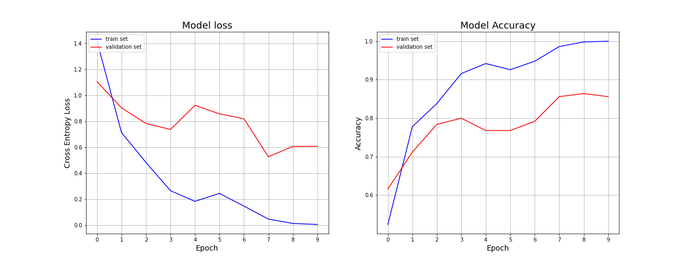

# CNN-in-NumPy
The project serves a purpose of demystifying internal CNN mechanisms of forward and back propagation. 

For this purpose we used multiple NumPy functions to train the CNN model on the keras MNIST dataset.
<p align="center">
<!--      -->
    
</p>

The idea was to (+/-) replicate the tensorflows model of the given pipeline:

```python
    model = keras.Sequential()
    model.add(
        keras.layers.Conv2D(filters=32, kernel_size=(3, 3),
        activation="relu", input_shape=(28, 28, 1))
    )
    model.add(
        keras.layers.Conv2D(filters=64, kernel_size=(3, 3),
        activation="relu")
    )
    model.add(keras.layers.MaxPool2D(pool_size=(2, 2)))
    model.add(keras.layers.Flatten())
    model.add(keras.layers.Dense(128, activation="relu"))
    model.add(keras.layers.Dense(10, activation="softmax"))
              
    model.compile(
        loss='categorical_crossentropy',
        optimizer=keras.optimizers.Adadelta(learning_rate=1),
        metrics='accuracy'
    )
```
## Simplifications / constraints / assumptions

1. The model uses simple gradient descent optimizer (which means constant learning rate)
2. For now the model is static, therefore adjusting of layers order is limited
3. Handles one image at the time
4. Doesn't include bias matrices

## Sample run results

> *Model was initially run on 625 training sample (500 for actual training, and 125 for validation) on 10 epochs.*
*Plots below show the history of loss and accuracy for this approach.*
*The model clearly overfits due to the small sample size, but it can be seen that loss is minimized between epochs.*



## To-be-done
- [ ] optimization by translating to machine code (numba / cython)
- [ ] Adding Dropout layers
- [ ] Making one universal convolution function with adjustable parameters
- [ ] Including bias matrices
- [ ] Including batch size > 1
- [ ] Including easier modification of parameters such as number of hidden layers / number of convolution - maxpool sequences
- [ ] Further optimization of functions

## Collaborators
* Gregor Baer [[github]](https://github.com/gregorbaer)
* Marius Lupulescu [[github]](https://github.com/mariusadrian77)
* Lachezar Popov

## References
* [Mathematics behind backpropagation in CNN [medium]](https://medium.com/@ngocson2vn/a-gentle-explanation-of-backpropagation-in-convolutional-neural-network-cnn-1a70abff508b)
* [Convolution derivation [medium]](https://pavisj.medium.com/convolutions-and-backpropagations-46026a8f5d2c)
* [Max Pool derivation [medium]](https://medium.com/the-bioinformatics-press/only-numpy-understanding-back-propagation-for-max-pooling-layer-in-multi-layer-cnn-with-example-f7be891ee4b4)
* [Block shaped matrices [stack]](https://stackoverflow.com/questions/16873441/form-a-big-2d-array-from-multiple-smaller-2d-arrays/16873755#16873755)

## License
MIT License | Copyright (c) 2021 Jan Androsiuk
